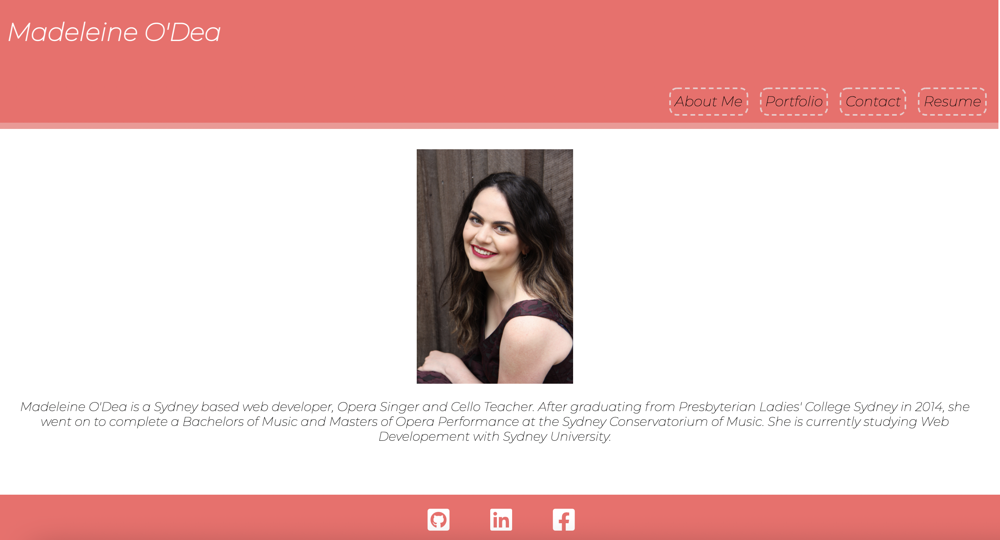
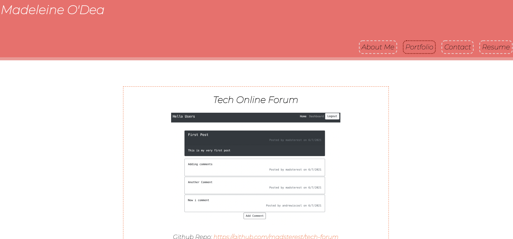
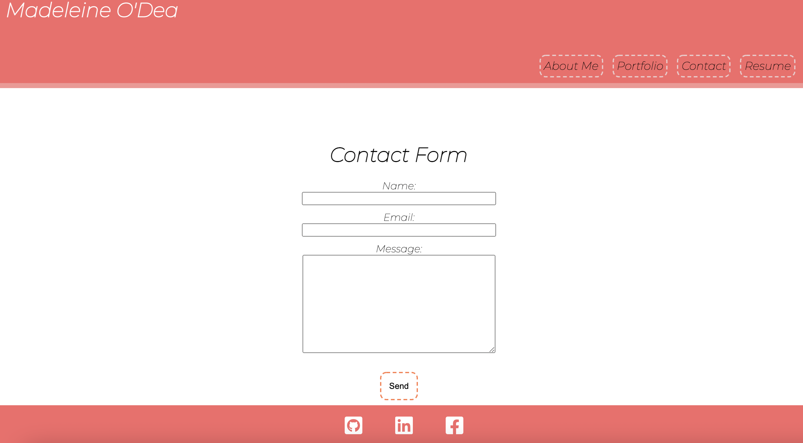

# Madeleine-O'Dea-Profile-Page

# Description

This is my personal web development site! It includes a bio, resume, contact-me form as well as links to my github, linked-in and facebook. I used React and CSS to create this site.
The projects page has examples of my work with links to the deployed version and the github repository.
I hope you enjoy!!

# Table of Contents

- [Useage](#useage)
- [Contributing](#contributing)
- [License](#license)
- [Questions](#questions)

# Useage

Deployed at https://madsterest.github.io/react-portfolio/

# Contributing

Created by Madeleine O'Dea

# License

Licensed under MIT. 
For more information, visit this link. 
https://opensource.org/licenses/MIT

# Questions

For more examples of my work, please visit my GitHub at [madsterest](https://github.com/madsterest)
or contact me at
odea.madeleine@gmail.com
